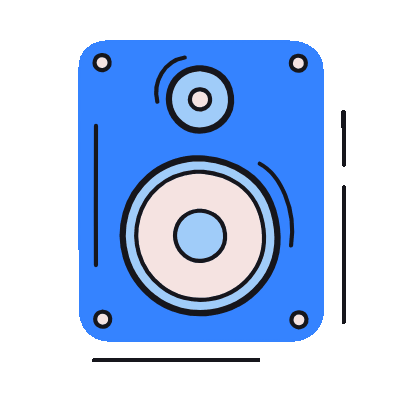

<h1 align="center">Name of Podcast</h1>

   

## A Message From the Host

My name is **Host Name**, and I'm the creator and host of *Podcast Name*.

There are lots of ways to interact with the show! 

## Get in Touch:

- **❓[submit a question](https://github.com/monapdx/GitPod/issues/new?template=ask-host.yml)** to the host 
- Share a **📖[personal story](https://github.com/monapdx/GitPod/issues/new?template=share-story.yml)** about a topic we cover 
- **📬[pitch a guest](https://github.com/monapdx/GitPod/issues/new?template=guest-pitch.yml)** 
- Enter our **🎁[weekly giveaway contest](https://github.com/monapdx/GitPod/issues/new?template=enter-contest.yml)**!

---
## Content Warning

> If you need to include one, enter it here.

## Episode Archive

<!-- EPISODES_TABLE_START -->

| Episode No. | Title |
|---:|---|
| 1 | [TITLE GOES HERE]() |
| 2 | [HERE IS ANOTHER TITLE]() |
| 3 | [TITLE OF A DIFFERENT LENGTH]() |
| 4 | [THIS IS KIND OF LIKE A TRACK LISTING]() |
| 5 | [IT IS...ISN'T IT?]() |
| 6 | [LAZY, UNIMAGINATIVE TITLE]() |
| 7 | [SHARP, BRILLIANT TITLE]() |
| 8 | [TITLE THAT IS SOMEWHERE BETWEEN BRILLIANT AND LAZY]() |
| 9 | [MY BEST TITLE YET, BY FAR]() |
| 10 | [IT'S OFFICIAL: I HAVE RUN OUT OF TITLES]() |

<!-- EPISODES_TABLE_END -->

<h2 align="center">Disclaimer</h2>

 <i>If appropriate, include any disclaimers needed here.</i>

